## 1. 데이터베이스 시스템

### 데이터
관찰의 결과로 나타난 정량적 혹은 정성적인 실제 값
### 데이터베이스
- 데이터베이스 : 조직에 필요한 정보를 얻기 위해 논리적으로 연관된 데이터를 모아 구조적으로 통합해 놓은 것
- 데이터베이스 시스템은 데이터의 검색(select)과 변경(insert, delete 등) 작업을 주로 수행함
- 변경이란 시간에 따라 변하는 데이터 값을 데이터베이스에 반영하기 위해 수행하는 삽입, 삭제, 수정 등의 작업을 말함.
### 데이터베이스의 개념
- 통합된 데이터: 데이터를 통합하는 개념. 각자 사용하던 데이터의 중복을 최소화하여 중복으로 인한 데이터 불일치 제거
- 저장된 데이터: 문서로 보관된 데이터가 아니라 컴퓨터 저장장치에 저장된 데이터
- 운영 데이터: 조직의 목적을 위해 사용되는 데이터. 즉, 업무를 위한 검색을 목적으로 저장됨
- 공용 데이터: 한 사람 또는 한 업무를 위해 사용되는 데이터가 아니라 공동으로 사용되는 데이터를 의미
### 데이터베이스의 특징
- 실시간 접근성: 데이터베이스는 실시간으로 서비스된다. 사용자가 데이터를 요청하면 수 초 내에 결과를 서비스한다.
- 계속적인 변화: 데이터베이스에 저장된 내용은 한 순간의 상태이지만, 데이터 값은 시간에 따라 항상 바뀐다.
- 동시 공유: 데이터베이스는 서로 다른 업무, 여러 사용자에게 동시에 공유된다.(병행= parallel)
- 내용에 따른 참조: 데이터베이스에 저장된 데이터는 물리적인 위치가 아니라 값에 따라 참조된다.

### DBMS
데이터베이스 관리 시스템. 데이터베이스 관리, 응용프로그램 들이 DB를   공유하여 사용할 수 있는 환경 제공
### 데이터베이스 스키마
전체적인 데이터베이스의 구조. 자주 변경x. 내포(intension)
### 데이터베이스 상태
특정 시점의 데이터베이스의 내용. 자주변경o. 외연(extension)
### 데이터베이스 시스템(DBS: Database System)의 구성요소
- 데이터베이스, 사용자(응용 프로그램), DBMS, 하드웨어
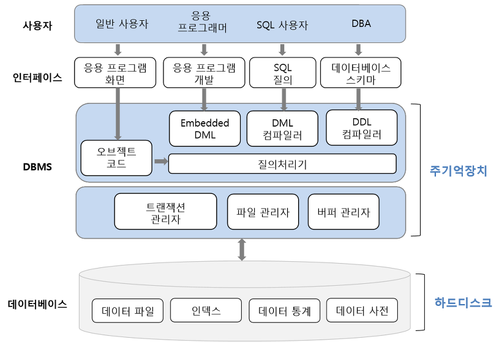
### 파일 시스템
- 데이터를 파일단위로 파일서버에 저장
- 각 컴퓨터는 LAN을 통하여 파일 서버에 연결되어 있고, 파일 서버에 저장된 데이터를 사용하기 위해서 각 컴퓨터의 응용 프로그램에서 열기/닫기(Open/Close)를 요청
- 각 응용프로그램이 독립적으로 파일을 다루기 때문에 데이터가 중복 저장될 가능성이 있음
- 동시에 파일을 다루기 때문에 데이터의 일관성이 훼손될 수 있음
### 데이터베이스 시스템
- DBMS를 도입하여 데이터를 통합 관리하는 시스템
- DBMS가 설치되어 데이터를 가진 쪽을 서버(Server), 데이터를 요청하는 쪽을 클라이언트(Client)라고 함
- DBMS서버가 파일을 다루며 데이터의 일관성 유지, 복구, 동시 접근 제어 등의 기능 수행
- 데이터의 중복을 줄이고 데이터를 표준화하며 무결성을 유지함
### 데이터 모델
- DB의 구조를 기술하는데 사용되는 개념들의 집합인 구조. EX)엑셀: 관계형 데이터 모델
- 현실 세계의 정보들을 컴퓨터에 표현하기 위해서 단순화, 추상화 하여 체계적으로 표현한 개념적 모형
### 데이터 모델의 분류
 1. 고수준 또는 개념적 데이터 모델: DB의 전체적인 논리적 구조 명시. 엔터티-관계 데이터모델, 객체 지향 데이터 모델
 2. 표현 데이터모델: 최종 사용자가 이해하는 개념, 데이터가 조작되는 방식과 멀리 떨어져 있지는 않다. 계층, 네트워크, 관계 데이터 모델.
 3. 저수준 또는 물리적 데이터 모델: 시스템이 인식하는 것과 가까운데, DB에 데이터가 어떻게 저장되는가를 기술. Unifying, ISAM, VSAM.
### DBMS 발전과정
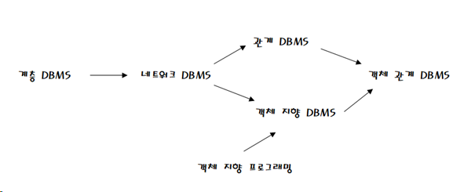
### 계층 DBMS
트리 구조를 기반으로 하는 계층 데이터 모델을 사용한 DBMS. 빠른 속도와 높은 효율성. 레코드 구조 변경 어렵. 프로그램 수정 어렵. 데이터 독립성 제한. 복잡한 관계표현 어렵. 중복 데이터와 관련 문제 발생.
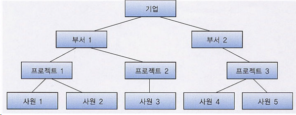
### 네트워크 DBMS
자식->복수의 부모 데이터에 속함.1:n->n:n
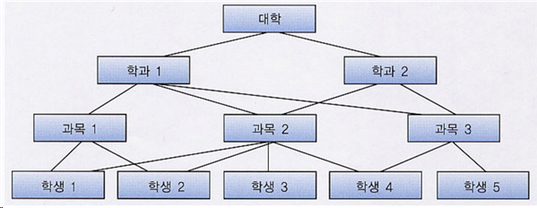
### DDL
데이터 정의어 CREATE, ALTER, DROP, RENAME, TRUNCATE
### DML
데이터 조작어 SELECT, INSERT, DELETE, UPDATE
### 절차적 언어
어떤 데이터가 필요하고 어떻게 데이터를 찾을 것인가를 명시
### 비절차적 언어
어떤 데이터를 원하는가만 명시.SQL은 대표적 비절차적 언어.
### ANSI/SPARC 아키텍처의 3단계
- 외부단계: 각 사용자가 보는 개인적 DB 스키마
- 개념단계: 모든 사용자 관점을 통합한 DB 스키마
- 내부단계: 물리적으로 데이터가 저장되는 방법을 표현하는 스키마
### 3단계 아키텍처의 목적
DB에 대한 사용자의 관점과 DB가 실제로 표현되는 방식을 분리
### 데이터 독립성
상위 단계의 스키마 정의에 영향을 주지 않으면서 어떤 단계의 스키마 정의를 변경할 수 있음.
### 논리적 데이터 독립성
개념 스키마의 변화로부터 외부 스키마가 영향 받지 않음.
### 물리적 데이터 독립성
내부 스키마의 변화로부터 개념, 외부 스키마가 영향을 받지 않음.
### API
공통적으로 사용되는 DB 접근 유형을 위한 라이브러리 함수들의 모임.
### 중앙 집중식 데이터베이스 시스템
데이터베이스 시스템이 하나의 컴퓨터 시스템에서 운영된다.
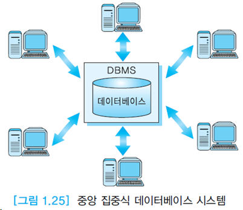
### 분산 데이터베이스 시스템
네트워크로 연결된 여러 사이트에 DB 자체가 분산되어 있으며, DB시스템도 여러 컴퓨터 시스템에서 운영.
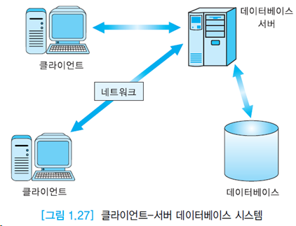
### 클라이언트-서버 데이터베이스 시스템
PC 또는 워크스테이션처럼 자체 컴퓨팅 능력을 가진 클라이언트를 통해 DB 서버 접근. DB시스템의 기능이 서버와 클라이언트에 분산. DB를 보다 넓은 지역에서 접근 가능, 하드웨어 비용 절감/ 보안이 다소 취약.
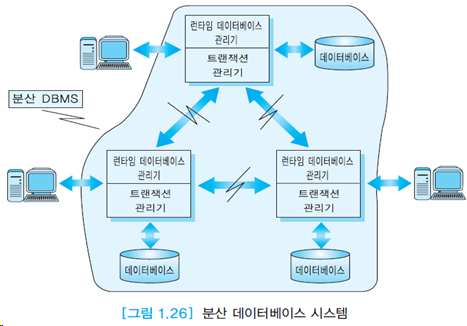

## 2. 관계 데이터 모델과 제약조건

### 릴레이션
- 릴레이션: 행과 열로 구성된 테이블
- 속성(Attribute): 세로 값으로 열(Column)이라고도 한다.
- 튜플(Tuple): 가로 값으로 행(Row)이라고도 한다.
- 카디날리티(Cardinality): 튜플의 수
- 차수: 속성의 수
- 도메인(Domain): 속성이 가질 수 있는 값의 집합
- 인스턴스: 정의된 스키마에 따라 테이블에 실제 저장된 데이터의 집합. 외연.
- 스키마: 릴레이션이 어떻게 구성되는지, 어떤 정보를 담고 있는지에 대한 기본적인 구조를 정의(첫 행 헤더). 릴레이션이름(애트리뷰트1, 애트리뷰트2, ...애트리뷰트N) .내포.
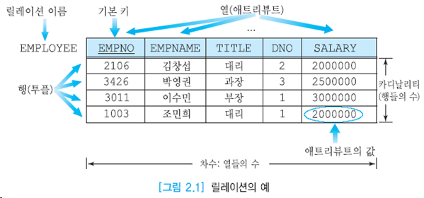
### 릴레이션의 특징
- 속성은 단일 값을 가진다
- 속성은 서로 다른 이름을 가진다
- 한 속성의 값은 모두 같은 도메인 값을 가진다
- 속성의 순서는 상관이 없다
- 릴레이션 내의 중복된 튜플은 허용하지 않는다
- 튜플의 순서는 상관없다
### 릴레이견 키
각 튜플들을 고유하게 식별 할 수 있는 하나 이상의 애트리뷰트들의 모임.
- 수퍼 키: 한 릴레이션 내의 특정 튜플을 고유하게 식별하는 하나의 애트리뷰트 또는 애트리뷰트들의 집합. 튜플들을 고유하게 식별하는데 꼭 필요하지 않은 애트리뷰트들을 포함한다는 문제점 있음.
- 후보 키: 각 튜플을 고유하게 식별하는 최소한의 애트리뷰트들의 모임. 후보 키도 두 개 이상의 애트리뷰트로 이루어질 수 있으며 이런 경우 복합 키 라고 부름.
- 기본 키: 두 개 이상의 후보 키에서 하나를 기본 키로 선정. 널값이나 중복된 값x. 자연스러운 기본키 찾을 수 없는 경우 인위적인 키를 애트리뷰트 릴레이션에 추가. 이런 키를 대리 키 라고 함.
- 대체 키: 기본 키로 선정 되지 않은 후보 키.
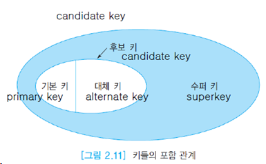
- 외래 키: 어떤 릴레이션의 기본 키를 참조하는 애트리뷰트. 참조되는 릴레이션의 기본 키와 동일한 도메인을 가져야 한다.
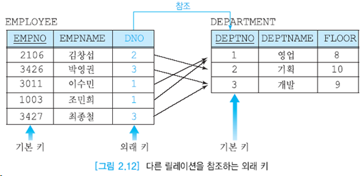
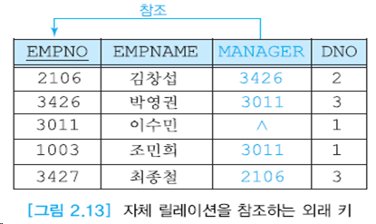
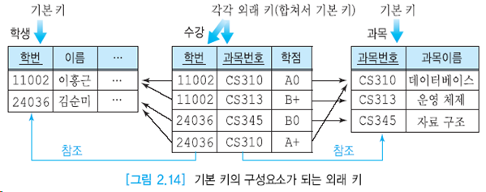
### 데이터 모델의 구성요소
데이터 구조, 연산자, 데이터 무결성
### 데이터 무결성
데이터의 정확성/유효성
### 도메인 제약조건
각 애트리뷰트 값이 반드시 원자값. 애트리뷰트에 저장되는 값들의 범위/유형 제한.
### 키 제약조건
키 애트리뷰트에 중복된 값 존재 x.
### 기본 키와 엔티티 무결성 제약조건
릴레이션의 기본 키를 구성하는 어떤 애트리뷰트도 널값을 가질 수 없다.
- 삽입: 기본키 값이 같으면 삽입이 금지됨
- 수정: 기본키 값이 같거나 NULL로도 수정이 금지됨
- 삭제: 특별한 확인이 필요하지 않으며 즉시 수행함
### 외래 키와 참조 무결성 제약조건
두 릴레이션의 연관된 튜플 사이에 일관성 유지.
- 부모릴레이션에 삽입: 정상적으로 진행됨
- 자식릴레이션에 삽입: 참조받는 테이블에 외래키 값이 없으므로 삽입 금지
- 부모릴레이션의 삭제: 참조하는 테이블을 같이 삭제할 수 있어서 금지하거나 추가작업이 필요
- 자식릴레이션의 삭제: 바로 삭제 가능함
- 수정: 삭제와 삽입의 연속 수행으로 각 삭제와 삽입의 제약을 고려하여 진행됨
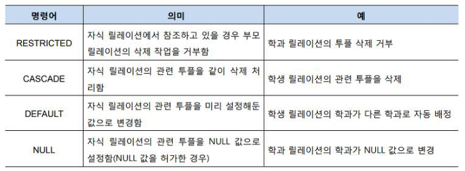

## 3. 오라클

### 세션
사용자가 오라클 서버로부터 인증 될 때부터 시작하여 사용자가 로그아웃을 하거나 비정상적으로 종료될때까지 지속. 로그인<->로그아웃 접근하여 한 행동
### 오라클 저장구조
논리적으로는 테이블스페이스에, 물리적으로는 데이터파일에 저장.
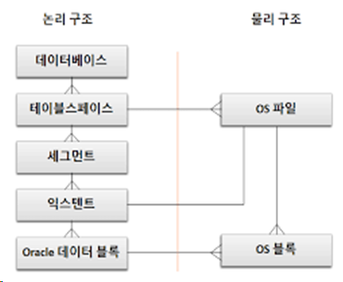
- 데이터베이스: 하나 이상의 테이블스페이스 포함
- 테이블스페이스: 하나 이상의 세그먼트를 포함.
- 세그먼트(segment): 특정 유형의 데이터 구조를 저장하기 위해 할당되는 익스텐트들의 집합
- 익스텐트(extent): 오라클 데이터블록으로 이루어짐.
- 오라클 데이터블록: 오라클 서버가 할당하고 입출력에 사용하는 가장 작은 단위.
### sql
- 유저 추가: CREATE USER ____IDENTIFIED BY ____;
- 권한 부여: grant ___ to ____;(connect, resource, create session, create view)
- 비번 변경: ALTER USER ____IDENTIFIED BY ____;
- DB 내의 테이블 정보: SELECT * FROM tab;
- 테이블 구조: DESCRIBE/DESC ____; 테이블 내용:SELECT * FROM ____;
- 애트리뷰트 추가: ALTER TABLE _1__ADD __2__  __3__;  1.테이블 이름 2.애트리뷰트 3.자료형
- 애트리뷰트 삭제: ALTER TABLE ____ DROP COLUMN _____;
### PL/SQL
SQL에 절차적인 기능 추가하여 확장한 것

## 4. 관계 대수와 SQL
## 5. 데이터베이스 설계와 ER 모델
## 6. 물리적 데이터베이스 설계
## 7. 릴레이션 정규화
## 8. 뷰와 시스템 카탈로그
## 9. 트랜잭션
## 10. 데이터베이스 보안과 권한 관리

