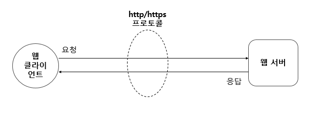
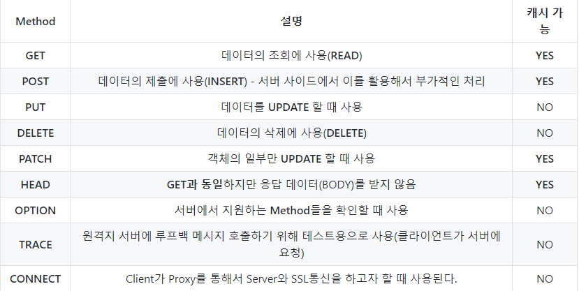
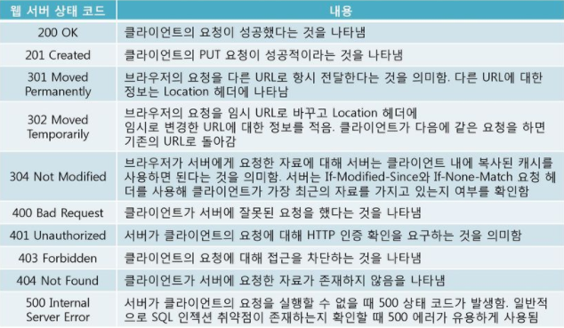

## 웹 프로그래밍이란
- HTTP(S) 프로토콜로 통신하는, 클라이언트와 서버를 개발하는 것
- 장고, 스프링과 같은 웹 프레임워크를 사용하여 웹 서버를 개발
- 웹 브라우저를 실행하여 네이버에 접속하는것도 웹 프로그램이 동작하는 것.
- 웹 브라우저가 웹 클라이언트, 서버는 웹 서버. 즉, 웹 클라이언트가 요청하고 웹 서버가 응답하는 클라이언트-서버 프로그램이 동작하는 것

## HTTP 프로토콜
- HTTP는 웹 서버와 웹 클라이언트 사이에서 데이터를 주고받기 위해 사용하는 통신 방식으로, TCP/IP 프로토콜 위에서 동작.
## HTTP 처리 방식

## 상태 코드
